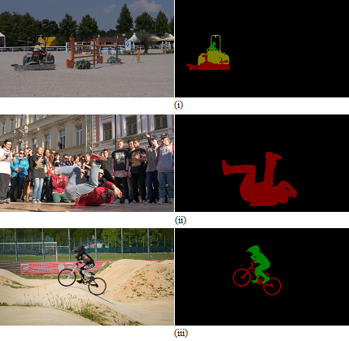
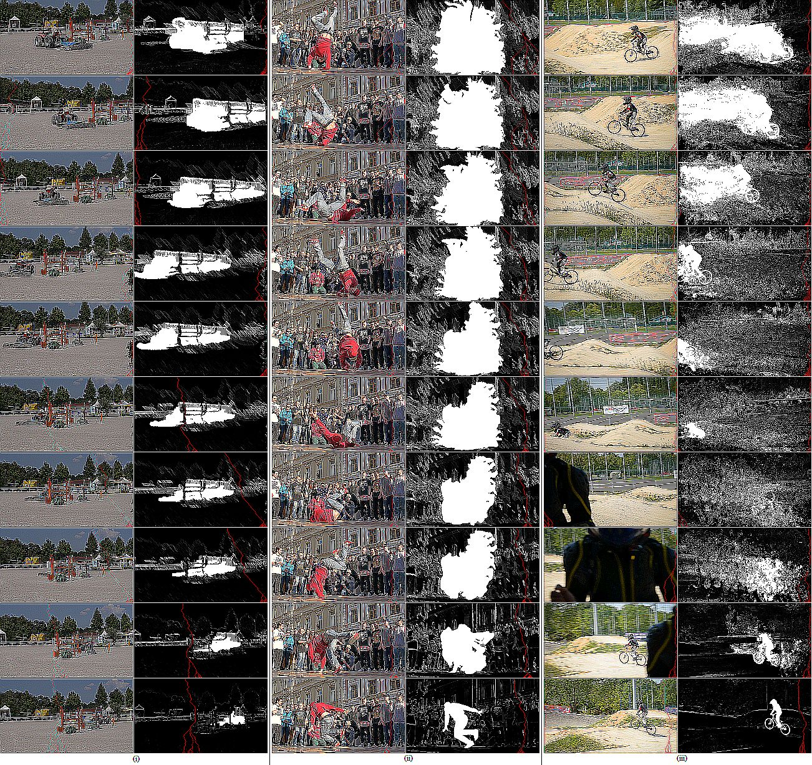
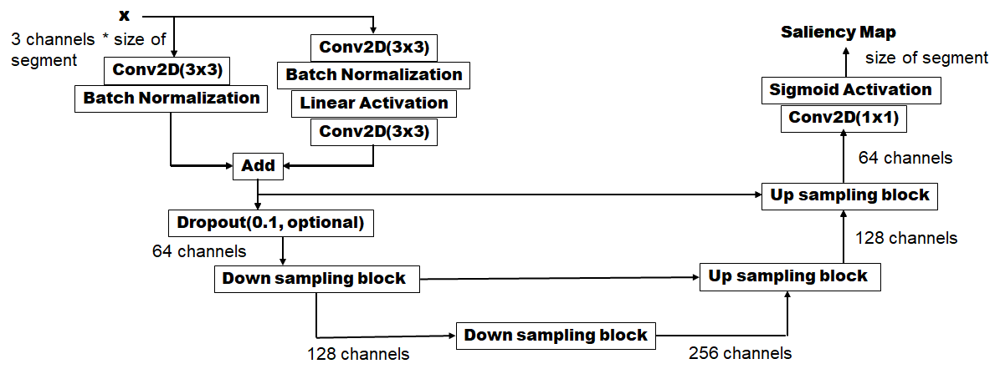
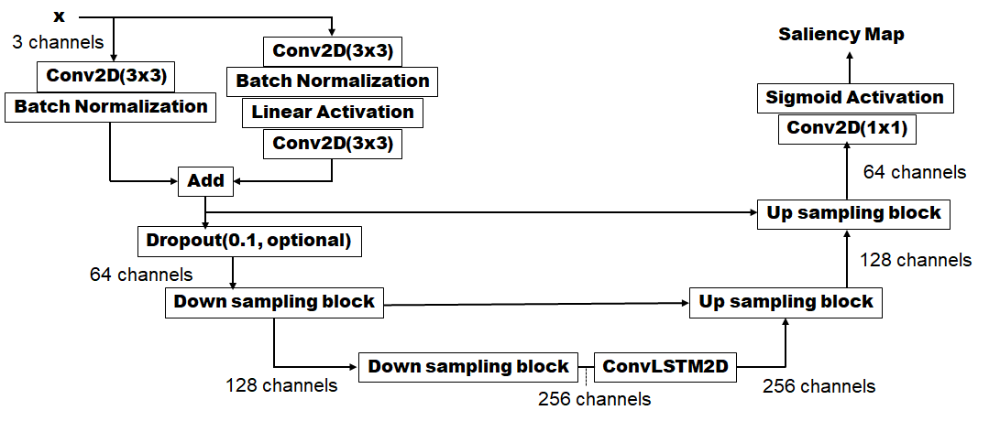
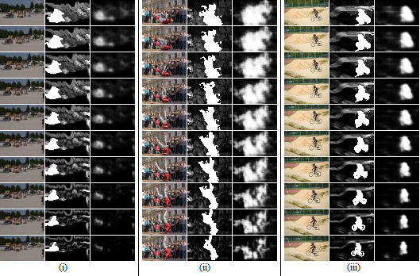

# Seam-Carving-in-Videos
Generating a saliency map for each frame of a video that can maintain visual consistency across frames when seam carving is performed.

### Seam Carving in Images ###
The seam carving algorithm, proposed by [Avidan et al.](http://www.faculty.idc.ac.il/arik/SCWeb/imret/index.html), deals with content-aware image resizing in two steps: it first generates an energy map with an energy function (e.g. magnitude of gradient), then a horizontal or vertical seam, an 8-connected path starting from one of the edges, is calculated dynamically along the lowest cumulative energy. by removing the calculated seams repeatedly, an image can be shrunk, ideally retaining the salient regions without introducing noticeable artefacts.

### Video Resizing ###
Extending this method to video sequences has been a struggle: consistency across frames is difficult to retain, and taking multiple image frames into account greatly increases computational complexity. [Improved Seam Carving for Video Retargeting](http://www.eng.tau.ac.il/~avidan/papers/vidret.pdf) attempts to do this using graph cuts, which is computationally expensive. 

The solution: generating saliency map for each frame of a video that allows for seam carving using dynamic programming while maintaining temporal coherency. The project provides a method for generating saliency maps for each frame of a video that incorporates temporal information. It uses deep learning convolutional neural networks to map these video frames to the corresponding saliency maps generated using the method mentioned previously. 

### Dataset ###
In order to train  network to generate saliency maps that incorporate temporal information regarding the entire video, our training target needs to include the following information:
- Energy of the current frame
- Segmentation of foreground objects in the current frame
- Energy and segmentation of all frames after the current frame

For the segmentation of foreground objects, [DAVIS 2017 Video Segmentation Dataset](https://davischallenge.org/davis2017/code.html#unsupervised) was used, which consists of 90 RGB videos, each frame with a corresponding segmentation mask annotating the subject of the video. Specifically, the 480p version was used for target generation.

    

    <em>Video frames and their corresponding segmentation masks sampled from videos (i)’tractor-sand’, (ii)’breakdance’ and (iii)’bmx-bumps’ in the DAVIS dataset.</em>

For each video, the energy Ei of the ith frame Fi is calculated by:

Ei=∇σ(Fi)

where σ(Fi) is the Sobel Operator applied to the current frame. The value of Ei is normalized to (0,1). 

The segmentation S'i is calculated from annotation Si of the DAVIS 2017 dataset by

S'i(x,y)= 0 if Si(x,y)=0

S'i(x,y)= 1 otherwise

The saliency map Mi is then calculated by

Mi(x,y)=max⁡(Ei(x,y), S'i(x,y))

In order to incorporate temporal information into the target, the dense optical flow from Mi to Mi+1 is calculated, which gives us (dx/dt,dy/dt) for each pixel in the ith frame. Starting from the last frame and propagating to the first frame, each target saliency map Ti are calculated by

Ti(x,y)=max⁡(Mi+1(x+dx,y+dy),Mi(x,y))

    

    <em>Video frames and their corresponding target saliency maps sampled from videos (i)’tractor-sand’, (ii)’breakdance’ and (iii)’bmx-bumps’ in the DAVIS dataset. Dynamic programming was used to determine 50 seams with the lowest cumulative energy (marked in red).</em>

### Neural Networks ###
The network architectures experimented with were inspired from Residual U-Net described in [Road Extraction by Deep Residual U-Net](https://arxiv.org/abs/1711.10684). The implementation for Residual U-Net (without LSTM) was adapted from [this repository](https://github.com/DuFanXin/deep_residual_unet).

    

    <em>Residual U-Net</em>

    

    <em>Residual U-Net with LSTM</em>

### Results ###
Due to hardware limitations, the video frames had to be resized to 56x32 and sliced into segments of 10 frames each. The netork has been trained on such segments. The results for a randomly sampled sequence of 10 frames from (i)'tractor-sand', used for training, and (ii)'breakdance' and (iii)'bmx-bumps', used only for validation is shown below.

    

